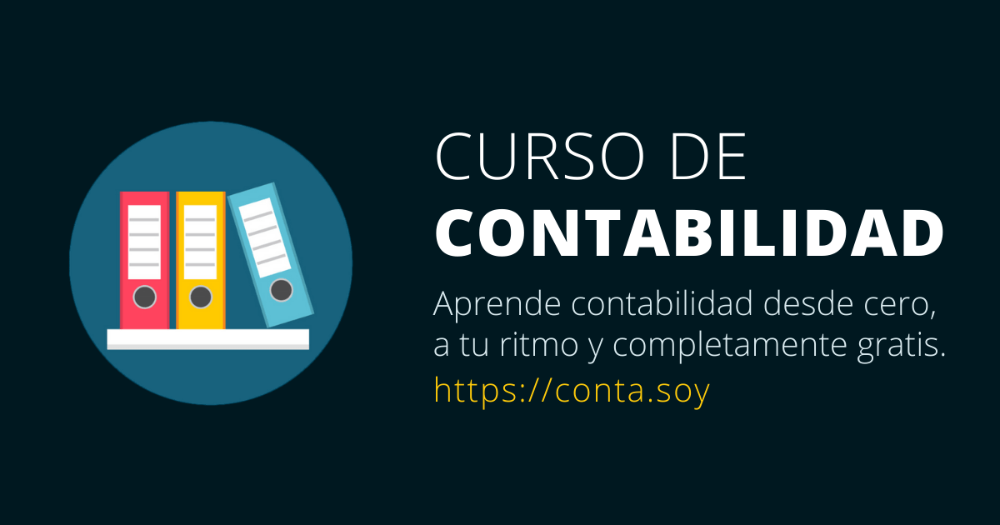

## Curso de contabilidad📊

Este proyecto nace porque siempre tuve la ilusión de compartir mi conocimiento y apoyarnos entre todos para superarnos como profesionistas y como personas.

Comenzar curso: https://conta.soy

## Contribuir ⚙

Si quieres contribuir en este proyecto, lo puedes hacer de dos formas:

1. Envía tu contenido/contribución por correo electrónico a israel[at]todoconta.com.
2. Directamente en este proyecto a través de un pull request detallando la mejora o contribución.

## Tecnologías 💎

Este sitio es creado con las siguientes tecnologías y frameworks.

- Gatsby
- React
- [Rocket Docs](https://github.com/Rocketseat/gatsby-themes) (Gastby starter)

## Instalar proyecto 💻

1. Descarga este repositorio.

   ```sh
   git clone https://github.com/iscasur/curso-contabilidad.git
   ```

2. Iniciar proyecto en modo desarrollo.

   ```sh
   cd curso-contabilidad
   gatsby develop
   ```

3. Ver proyecto en vivo

   El sitio estará corriendo de forma local en `http://localhost:8000`

## Licencia ✨

Este proyecto está bajo la licencia MIT.